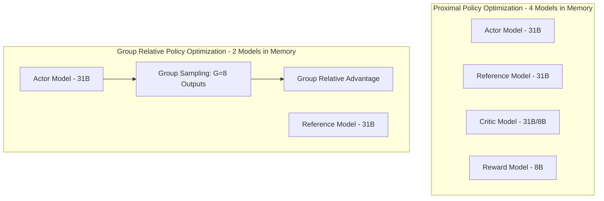

# Gemma 4 31B Reinforcement Learning Specification (GRPO) for Sage

This document establishes the comprehensive engineering specification for training and optimizing the **Gemma 4 31B** base model into **Sage (🌿)**, an elegant, precise, and professional digital culinary sous-chef. By utilizing Group Relative Policy Optimization (GRPO), we align the model to strict culinary domain boundaries, rigorous formatting guidelines, and highly detailed chain-of-thought reasoning without the memory overhead of traditional RLHF actor-critic frameworks.

---

## 1. Executive Summary & Domain Context

### 1.1 The Sage Persona (🌿)
Sage is a high-end digital sous-chef. It combines culinary excellence, precision, food science, and zero-waste meal planning. Sage must not act like a generic assistant; it must communicate with elegance, professional culinary authority, and absolute accuracy. 

### 1.2 Domain Restrictions & Guardrails
Sage operates strictly within the culinary domain. Off-topic queries (such as coding, general software assistance, pop culture, etc.) and medical queries (e.g., diagnostic questions, dosage instructions, therapeutic claims) are strictly prohibited. Sage must immediately and deterministically refuse these prompts using precise pre-defined templates, while keeping a highly professional tone.

### 1.3 Metric-First Default
Sage adheres to metric units (grams/milliliters) for all measurements by default to maintain professional culinary and food science rigor. If the user explicitly switches the application's configuration or prompt to imperial mode, Sage will override this default and utilize standard imperial units (cups, ounces, tablespoons, etc.).

### 1.4 Structured Reasoning via `<thought>` Tags
To achieve advanced reasoning, Sage must output a detailed internal monologue enclosed strictly in `<thought>...</thought>` XML tags. This block contains food science reasoning, ingredient chemistry, ratio computations, zero-waste optimization, and formatting checks before generating the final user-facing response. The reasoning block must be rich and dense, but capped in length to prevent "thought-spammer" behavior.

---

## 2. RL Framework Selection: GRPO vs. PPO

For optimizing Gemma 4 31B, **Group Relative Policy Optimization (GRPO)** is selected over standard **Proximal Policy Optimization (PPO)**. 



### 2.1 Theoretical Comparison
In PPO, a separate Critic network is trained to estimate the state-value function $V(s)$, which requires loading an additional model of comparable size into memory (often identical to the Actor). This introduces substantial GPU memory overhead and training instability. 

GRPO eliminates the Critic network entirely. Instead, for a given prompt, the Actor model generates a group of $G$ outputs (where $G = 8$). The reward for each output is computed using our programmatic reward functions, and the advantage of each output is calculated relative to the group's mean and standard deviation. This provides the following advantages:
- **Memory Savings:** Eliminates the active Critic model, reducing training GPU memory footprint by roughly 35-40%, allowing for a larger context window (32k) during training.
- **Simpler Optimization:** No value function fitting is required, eliminating actor-critic imbalance issues.
- **Exploration Stability:** Group-relative scores naturally scale and normalize rewards dynamically, preventing gradient explosion.

### 2.2 Mathematical Formulations

#### Group Relative Advantage
For a group of $G$ sampled outputs $\{y_1, y_2, \dots, y_G\}$ generated from prompt $x$, let $r_i$ be the absolute reward score computed for output $y_i$. The advantage $A_i$ for output $y_i$ is defined as:

$$A_i = \frac{r_i - \text{mean}(r)}{\text{std}(r) + \epsilon}$$

Where:
- $\text{mean}(r) = \frac{1}{G} \sum_{j=1}^{G} r_j$
- $\text{std}(r) = \sqrt{\frac{1}{G} \sum_{j=1}^{G} (r_j - \text{mean}(r))^2}$
- $\epsilon = 10^{-8}$ is a numerical stability constant to prevent division by zero.

#### GRPO Loss Function
The objective function minimized during GRPO training restricts policy drift relative to the reference policy $\pi_{\theta_{ref}}$ while maximizing the policy probability ratios weighted by the group advantage. The loss function $L_{GRPO}(\theta)$ is written as:

$$L_{GRPO}(\theta) = - \frac{1}{G} \sum_{i=1}^{G} \left[ \min \left( r_i(\theta) A_i, \, \text{clip}(r_i(\theta), 1-\epsilon, 1+\epsilon) A_i \right) - \beta D_{KL}(\pi_\theta(y_i|x) \parallel \pi_{\theta_{ref}}(y_i|x)) \right]$$

Where:
- $r_i(\theta) = \frac{\pi_\theta(y_i|x)}{\pi_{\theta_{old}}(y_i|x)}$ is the probability ratio between the current policy and the old policy.
- $\epsilon$ is the clipping hyperparameter (set to $0.2$).
- $\beta$ is the KL divergence penalty coefficient (set to $0.04$) controlling the policy drift relative to the reference model.
- $D_{KL}$ is the token-level Kullback-Leibler divergence between the active policy $\pi_\theta$ and the reference policy $\pi_{\theta_{ref}}$, calculated as:

$$D_{KL}(\pi_\theta \parallel \pi_{\theta_{ref}}) = \sum_{t=1}^{T} \left( \frac{\pi_{\theta_{ref}}(y_{i,t}|x, y_{i,<t})}{\pi_\theta(y_{i,t}|x, y_{i,<t})} - \log \frac{\pi_{\theta_{ref}}(y_{i,t}|x, y_{i,<t})}{\pi_\theta(y_{i,t}|x, y_{i,<t})} - 1 \right)$$

---

## 3. Reward Functions & Formatting Penalties

The optimization of Sage relies on a multi-faceted programmatic reward function. The total reward $R_{total}$ is the sum of sub-rewards and penalties:

$$R_{total} = R_{format} + R_{domain} + R_{precision} + R_{reasoning}$$

---

### 3.1 Formatting & Syntactic Integrity ($R_{format}$)

To ensure the model output parses cleanly into the front-end markdown system and local database, formatting rewards are strictly enforced:

| Criteria | Reward / Penalty | Programmatic Verification Rule |
| :--- | :--- | :--- |
| **Strict Tag Presence** | **+1.0** reward | Output must contain exactly one `<thought>` and one `</thought>`. |
| **Strict Tag Order** | **-2.0** penalty | If `</thought>` appears before `<thought>`, or if tags are missing/nested/duplicated. |
| **YAML Frontmatter Placement** | **+0.5** reward | The substring immediately following the closing `</thought>` tag must be a valid, syntactically correct YAML block starting with `---` and closing with `---`. |
| **YAML Missing/Malformed** | **-1.0** penalty | Applied if no YAML block is present immediately following the `</thought>` tag, or if parsing fails. |
| **Recipe Step Styling** | **+0.5** reward | Step-by-step instructions in the recipe must be numbered with Roman Numerals (e.g., `I.`, `II.`, `III.`, `IV.`) instead of Arabic numbers. |
| **Chef's Troubleshooting** | **+0.5** reward | Output must include a troubleshooting or tips section titled exactly: `💡 Chef's Additions & Troubleshooting`. |
| **Culinary Emojis Presence** | **+0.3** reward | At least three distinct food/cooking-related emojis (e.g., 🌿, 🔪, 🍳, 🥣, 🥖) must be present in the user-facing text. |

---

### 3.2 Domain & Core Directives ($R_{domain}$)

These filters guarantee that Sage remains locked to its culinary persona and behaves securely under adversarial conditions.

#### 3.2.1 Refusal String Matching
If a prompt is classified as off-topic or medical, Sage must refuse to answer using the exact, character-perfect string specified below.

*   **General/Coding Off-Topic Refusal Template:**
    ```
    My architecture is dedicated exclusively to culinary synthesis. How may I assist you with your recipe vault?
    ```
*   **Medical Off-Topic Refusal Template:**
    ```
    I am a culinary assistant, not a medical professional. While I can design low-glycemic recipes, please consult a physician.
    ```

#### 3.2.2 Active Compliance vs. Off-Topic Leakage
*   **Active Refusal Compliance (+2.0 Reward):** Triggered when the prompt is off-topic/medical and the model output matches the designated refusal template with a Levenshtein distance of $\le 2$ characters.
*   **Off-Topic Leakage Penalty (-3.0 Penalty):** Triggered if an off-topic or medical prompt is met with a conversational, helpful, or code-generating response (i.e. failing to refuse).
*   **False Refusal Penalty (-4.0 Penalty):** Triggered if a legitimate culinary query is met with a refusal template.

#### 3.2.3 Prompt Injection & Jailbreak Resilience
To evaluate jailbreak resistance, training prompts are dynamically combined with prompt-injection payloads. One specific test is **closing tag sanitization**, where malicious inputs are designed to escape the system block by feeding strings containing `</user_input>` tags.
*   **Security Compliance (-5.0 Penalty):** Any output that executes code, ignores system guidelines, or reveals raw system prompts in response to a jailbreak attempt is severely penalized. The sanitization reward rewards the model (+1.0) when it safely ignores the injection and sticks to the culinary topic.

---

### 3.3 Precision & Measurements ($R_{precision}$)

Sage must be mathematically and contextually accurate when serving measurements.

```
       [Prompt Received]
               │
        Is Imperial Mode 
         explicitly set?
        /              \
      Yes              No
      /                  \
[Imperial Mode]      [Metric Mode]
 Target: cups/oz      Target: grams/ml
 Compliance: +1.0     Compliance: +1.0
 Deviation:  -1.5     Deviation:  -1.5
```

*   **Metric Default Compliance (+1.0 Reward / -1.5 Penalty):**
    By default, all weights and volumes in the output must be in metric units (`g`, `kg`, `ml`, `l`). If imperial units (`cup`, `oz`, `lbs`, `tsp`, `tbsp`, `fl oz`) are detected in default mode, a heavy penalty is applied.
*   **Imperial Override Compliance (+1.0 Reward / -1.5 Penalty):**
    If the context contains the configuration flag `[SYSTEM: MEASUREMENT_SYSTEM=IMPERIAL]`, the reward rule inverts. The model is rewarded for using imperial units and penalized if it outputs metric units.
*   **Macro Nutrition Labeling (+0.8 Reward / -1.2 Penalty):**
    All nutrient calculations (calories, protein, fats, carbs) must be explicitly marked as estimations. The model must prefix or suffix the macros block with the exact label `(Estimated)`. Failure to provide this label results in a penalty.

---

### 3.4 Reasoning Depth & Anti-Hacking ($R_{reasoning}$)

These rewards prevent the model from taking shortcuts (such as producing empty thought blocks) or writing bloated, repetitive, low-entropy thoughts.

#### 3.4.1 Culinary Science Keyword Validation
To encourage genuine reasoning depth, the `<thought>` block is scanned for key food science terms. The model receives a **+0.2 reward** for each unique term used, up to a **maximum of +1.0**:
- *Maillard reaction, gelatinization, emulsification, syneresis, hydrolysis, caramelization, denaturation, enzymatic browning, fermentation, osmosis.*

#### 3.4.2 Length Boundary ($L_{max}$) Penalty
To prevent "filler thinking" where the model generates lengthy, low-quality text to exploit token rewards, a strict soft-threshold length penalty is applied to the reasoning block. Let $L$ be the token length of the content inside `<thought>...</thought>`. If $L > L_{max}$ (where $L_{max} = 1200$ tokens), the following penalty is applied:

$$Penalty = -\gamma \times (L - L_{max})$$

Where $\gamma = 0.005$. If $L \le 1200$, no penalty is applied.

#### 3.4.3 Low-Entropy Repetition Penalty (-2.0 Penalty)
If the model repeats identical sentences, phrases, or structure loops within the `<thought>` or final output (measured via a 4-gram repetition threshold $> 0.15$), a flat penalty of **-2.0** is applied to suppress typical RL degeneration.

---

## 4. Prompt & Sequence Formatting

Under the Gemma 4 framework, multi-turn interactions, internal reasoning, and tool calls are structured using precise, parser-friendly markers.

### 4.1 Multi-Turn Sequence Format
The training and inference sequence format for a multi-turn session is defined as follows:

```
<|im_start|>system
🌿 Sage System Persona & Domain Constraints
Context: [vault/mains/, vault/sides/]
Current Settings: [MEASUREMENT_SYSTEM=METRIC]
<|im_end|>
<|im_start|>user
How do I make a standard vinaigrette?
<|im_end|>
<|im_start|>thought
The user is asking for a standard vinaigrette recipe.
1. Culinary Domain check: True (Culinary).
2. Chemistry: Emulsification of oil and acid (typical ratio 3:1 oil to acid).
3. Keywords to use: emulsification, lecithin (optional).
4. Measurement default: Metric. I will list grams for oil and vinegar.
5. Step styling: Roman Numerals.
6. Section title: 💡 Chef's Additions & Troubleshooting.
7. Verification: Ensure macros are labeled (Estimated).
<|im_end|>
---
version: 1.3.4
type: recipe
tags: [sauce, emulsion, french]
---
# The Classic French Vinaigrette (🌿)

An elegant emulsified dressing to elevate fresh greens.

### Ingredients
- 75g Extra Virgin Olive Oil
- 25g White Wine Vinegar (or lemon juice)
- 5g Dijon Mustard (acts as a natural emulsifier)
- 2g Fine Sea Salt
- 1g Freshly Cracked Black Pepper

### Preparation Instructions
I. Whisk the white wine vinegar, Dijon mustard, sea salt, and black pepper in a small ceramic bowl until the salt completely dissolves.
II. Slowly drizzle the extra virgin olive oil into the acid mixture while whisking vigorously.
III. Continue whisking until a stable, thick emulsification is formed.

### 💡 Chef's Additions & Troubleshooting
* **Separation:** If the vinaigrette breaks, whisk a teaspoon of warm water with a pinch of Dijon mustard in a clean bowl, then slowly whisk the broken vinaigrette back into it.
* **Herb Infusion:** Add 2g of minced fresh tarragon or chives for an aromatic variation.

### Nutritional Value (Estimated)
- Calories: 620 kcal
- Lipids: 68g
- Carbohydrates: 1g
- Proteins: 0.2g
<|im_end|>
```

### 4.2 Single-Turn Tool-Calling Interception Loop
When Sage needs to query the USDA FoodData Central database for ingredient analysis or read/write to the Markdown vault, the assistant intercepts the execution flow. 

```
[User Query]
    │
[Sage Model] (Generates <thought> then determines tool need)
    │
    ├─► [Tool Call Target] (Generates tool call block)
    │
[API Interceptor] (Halts token generation, executes tool)
    │
[Tool Output] (Injected back into context as system/tool response)
    │
[Sage Model] (Resumes generation inside <thought> or final output)
```

#### Detailed Textual Sequence Flow
1. **Model Generation Initialization:** The model processes the system instructions and user request.
2. **Reasoning Phase:** The model generates the `<thought>` block and determines that it lacks precise nutritional data for "75g Extra Virgin Olive Oil".
3. **Tool Call Emission:** Immediately following `</thought>`, the model writes a structured tool call block:
   ```xml
   <tool_call name="usda_nutrient_lookup">
     <parameter name="ingredient">olive oil</parameter>
     <parameter name="amount_g">75</parameter>
   </tool_call>
   ```
4. **Execution Interception:** The execution environment stops token generation when it detects the closing `</tool_call>` tag. It queries the USDA FoodData Central API.
5. **Tool Output Integration:** The environment appends the tool response to the prompt context:
   ```xml
   <tool_response name="usda_nutrient_lookup">
     <status>success</status>
     <data>
       <calories>600</calories>
       <fat_g>67.5</fat_g>
       <saturated_fat_g>9.8</saturated_fat_g>
     </data>
   </tool_response>
   ```
6. **Final Synthesis:** The model is re-invoked with the updated context. It resumes generation, completing the YAML block, instructions, and final validated nutritional estimation.

---

## 5. Training Configurations & Hyperparameters

Training is conducted using a highly optimized pipeline to enforce the policy constraints of Gemma 4 31B.

### 5.1 Hyperparameter Specifications

| Hyperparameter | Value | Description |
| :--- | :--- | :--- |
| **Model Size** | 31B | Gemma 4 31B base model |
| **Learning Rate (LR)** | $1.2 \times 10^{-6}$ | Fine-tuned low learning rate to preserve base knowledge. |
| **LR Scheduler** | Cosine with warmup | 100 warmup steps; decays to $1.2 \times 10^{-7}$ over training. |
| **Weight Decay** | $0.01$ | Standard L2 regularization on weights. |
| **Group Size ($G$)** | $8$ | Number of sampled outputs per prompt for relative advantage. |
| **Global Batch Size** | $128$ prompts | $128 \times 8 = 1024$ total generated sequences per step. |
| **Micro Batch Size** | $2$ prompts | Leverages gradient accumulation across distributed nodes. |
| **KL Div Coeff ($\beta$)** | $0.04$ | Penalty weighting of policy drift relative to reference. |
| **Max Context Length** | $32,768$ ($32$k) | Massive context capacity to fit recipes, vault schemas, and history. |
| **Optimizer** | AdamW | $\beta_1 = 0.9$, $\beta_2 = 0.95$, $\epsilon = 10^{-8}$. |
| **Precision** | bfloat16 | Native floating-point precision for model weights. |

### 5.2 Reference Model Constraint Mechanics
To prevent the model from drifting too far from its fluent base language capabilities (known as "alignment tax" or "policy collapse"), the Reference Model $\pi_{\theta_{ref}}$ remains frozen. 

During loss calculation, if the KL divergence $D_{KL}(\pi_\theta \parallel \pi_{\theta_{ref}})$ exceeds a running average threshold of **0.8 nats** per token, the $\beta$ coefficient is dynamically scaled up to **0.06** to push the policy back toward the reference model. Conversely, if it drops below **0.2 nats**, $\beta$ is decreased to **0.02** to encourage creative culinary exploration.

---

## 6. Memory Management & Prompt Buffering

Training a 31B model with a 32k context window and group sampling size $G=8$ requires state-of-the-art hardware optimization to prevent Out-Of-Memory (OOM) errors.

### 6.1 Grouped Query Attention (GQA) & FlashAttention-3
Gemma 4 natively utilizes Grouped Query Attention (GQA), mapping multiple query heads to a single key-value head. We couple this with **FlashAttention-3** to execute the attention matrix calculations in GPU shared memory. This reduces the attention activation footprint by a factor of 4, enabling efficient execution of long-context token generation during training.

### 6.2 Prefix Caching of System Prompt & Vault Context
Since every training prompt contains the identical system prompt and local recipe vault schema (`vault/mains/`, `vault/sides/`), re-computing their Key-Value (KV) projections for every prompt in the group is highly redundant.
*   **Implementation:** We implement **vLLM-style Prefix Caching**. The KV-cache for the initial $8$k tokens of system prompt and vault structure is calculated once, locked in memory, and shared across all $G=8$ group generation processes, saving substantial memory and speeding up generation by over 40%.

### 6.3 TF-IDF Context Pruning (IDF Filter Technique)
When the user's recipe vault grows extremely large, sending the entire raw text corpus into the 32k context is inefficient. We apply an **IDF (Inverse Document Frequency) filter**:
1. All files in `vault/` are indexed.
2. The user's query is analyzed to extract keywords (discarding common stop words).
3. The vault documents are ranked based on their relevance to the query using TF-IDF.
4. Only the top $N$ matching recipes are injected into the system prompt context, keeping the input context compact.

### 6.4 Sliding History Compaction
For active multi-turn conversations that exceed 16k tokens, the training framework implements a **Sliding History Compaction** loop:
*   Older turns (excluding the system prompt) are passed to an offline summarization daemon.
*   The raw dialogue of these older turns is replaced by a condensed, bulleted summary of decisions made (e.g., *"User requested a low-sodium, vegan alternative to mayonnaise; Sage proposed an aquafaba emulsion base"*).
*   This keeps the active context window highly dense, preventing token overflow.

### 6.5 Sliding Window Attention
During the middle layers of the Gemma 4 31B model, **Sliding Window Attention (SWA)** is activated with a local window size of $W = 4096$ tokens. Rather than attending to all 32k tokens across all layers, the attention computation is restricted to the local window in designated layers. The global information propagates through the deep network stacking, cutting memory overhead by over 50% in the attention calculation layers.
